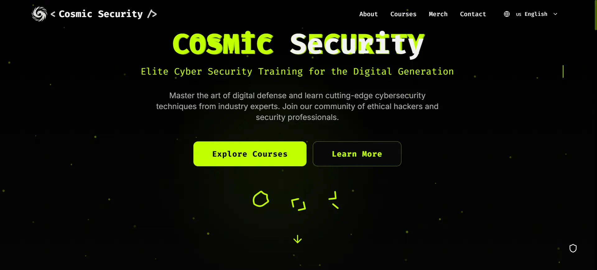

# 🌌 Cosmic Security

Cosmic Security is a futuristic-themed web application focused on cybersecurity solutions. Built with modern technologies such as React, Tailwind CSS, and GSAP for stunning UI animations.

## 🚀 Features

- 🪐 Animated landing page with GSAP
- 🌐 Language switcher (English / Bahasa Indonesia)
- 📱 Responsive and mobile-friendly layout
- 🎨 Cyberpunk-styled UI with Tailwind CSS
- 💾 Modular and maintainable component structure

## 📸 Preview



## 🛠️ Tech Stack

- **React** – Frontend library
- **Tailwind CSS** – Utility-first CSS framework
- **GSAP (GreenSock)** – Animation library
- **Lucide-react** – Icon library
- **Shadcn/ui** – Styled UI components
- **TypeScript** – For static type safety

## 🔧 Setup Instructions

1. **Clone this repository**
   ```bash
   git clone https://github.com/alifsuryadi/cosmic-security-web.git
   cd cosmic-security-web
   ```
2. **Install dependencies**
   ```bash
   npm install
   ```
3. **Start development server**
   ```bash
   npm run dev
   ```
4. Open `http://localhost:8080` to view the app in your browser.

## 🌍 Language Support

You can switch between:

- 🇺🇸 English

- 🇮🇩 Bahasa Indonesia

More languages coming soon!

## 📁 Project Structure

```
src/
│
├── components/ # Reusable UI components
├── pages/ # Page-level components
├── contexts/ # Global state (LanguageContext, etc.)
├── assets/ # Images, logos, icons
├── styles/ # Global styles
└── App.tsx # Main app file
```

## 🤝 Contributing

Contributions are welcome! Please fork the repo and submit a pull request.
